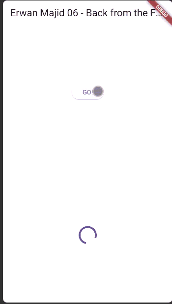
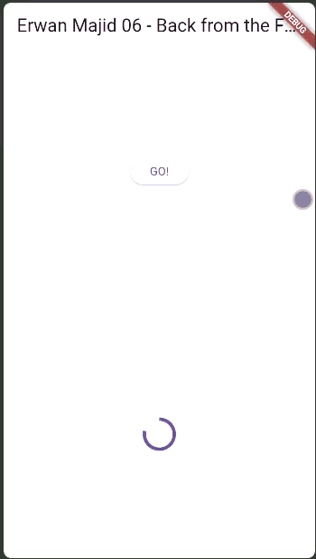
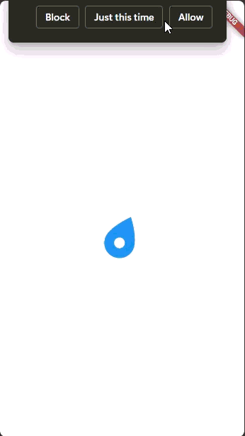
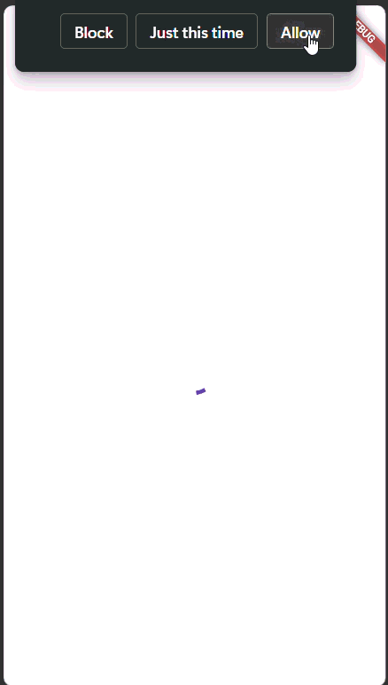
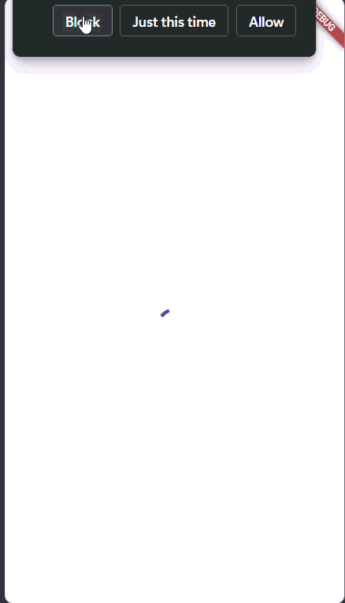
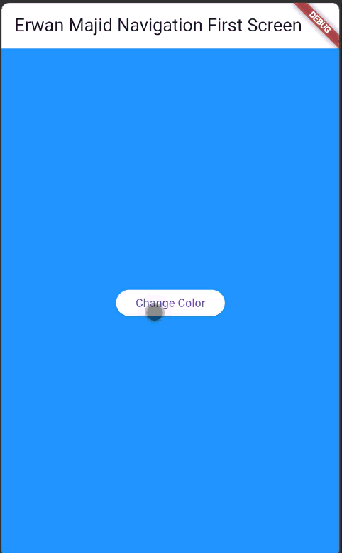

# Praktikum 1: Mengunduh Data dari Web Service (API)

## Soal 1

Tambahkan nama panggilan Anda pada title app sebagai identitas hasil
pekerjaan Anda


## Soal 2

cobalah akses di browser URI tersebut dengan lengkap seperti ini. Jika menampilkan data JSON, maka Anda telah berhasi


## Soal 3

Jelaskan maksud kode langkah 5 tersebut terkait substring dan catchError!

-substring : Untuk mencegah tampilan teks terlalu panjang di layar saat menampilkan hasil dari API.
Karena hasil Google Books API biasanya sangat panjang (ratusan baris JSON), jadi cukup ditampilkan sebagian

-catchError : digunakan untuk menangani error jika proses getData() gagal — misalnya:
Tidak ada koneksi internet, URL salah,Server API down

-setState : digunakan untuk memperbarui tampilan (UI) setiap kali nilai result berubah — baik saat sukses maupun error. Flutter akan me-render ulang Text(result) di layar dengan isi terbaru

substring(0, 450) membatasi teks dari hasil API supaya tidak terlalu panjang.
catchError menangkap dan menampilkan pesan error jika permintaan API gagal

## Result :


# Praktikum 2: Menggunakan await/async untuk menghindari callbacks

## Result :


## Soal 4

## Jelaskan maksud kode langkah 1 dan 2 tersebut!

method async :

tiga method asynchronous (returnOneAsync, returnTwoAsync, dan returnThreeAsync). Masing-masing method menggunakan Future.delayed selama tiga detik untuk mensimulasikan proses yang memerlukan waktu, seperti mengambil data dari server. Setelah waktu tunggu selesai, setiap method akan mengembalikan nilai bilangan bulat (1, 2, dan 3)

method count :
Di dalamnya terdapat variabel total yang digunakan untuk menampung hasil penjumlahan dari ketiga method sebelumnya. Prosesnya dilakukan secara berurutan menggunakan await, sehingga program akan menunggu setiap method selesai dijalankan sebelum melanjutkan ke berikutnya. Setelah ketiganya selesai, total hasil dijumlahkan menjadi 6 dan kemudian ditampilkan pada antarmuka pengguna melalui setState().

# Praktikum 3: Menggunakan Completer di Future

## Soal 5

## Result :


Jelaskan maksud kode langkah 2 tersebut!:

berfungsi untuk membuat proses asynchronous menggunakan Completer, yang memungkinkan kita mengontrol kapan sebuah Future dianggap selesai. Variabel completer menyimpan objek Completer<int> yang nantinya menghasilkan nilai berupa angka. Fungsi getNumber() memanggil calculate(), lalu mengembalikan Future dari completer. Sementara itu, fungsi calculate() menunda eksekusi selama 5 detik menggunakan Future.delayed(), kemudian menyelesaikan Future dengan memberikan nilai 42 melalui completer.complete(42). Hasilnya, setelah 5 detik, nilai 42 akan dikembalikan dan bisa ditampilkan ke layar.

## Soal 6

## Result :


Jelaskan maksud perbedaan kode langkah 2 dengan langkah 5-6 tersebut!

-Pada langkah 2, kode hanya menjalankan proses asynchronous dengan Completer, menunggu 5 detik, lalu mengembalikan nilai 42 tanpa memeriksa kemungkinan error.

-Sedangkan pada langkah 5–6, kode menambahkan blok try-catch untuk menangkap error selama proses Future.delayed, dan jika terjadi kesalahan, completer.completeError() dijalankan agar error dapat diteruskan ke .catchError() pada pemanggilan getNumber(). Dengan begitu, aplikasi menjadi lebih aman dan terkontrol karena mampu menampilkan pesan kesalahan jika terjadi error.

# Praktikum 4: Memanggil Future secara paralel

## Soal 7

Capture hasil praktikum Anda berupa GIF dan lampirkan di README. Lalu lakukan commit dengan pesan "W11: Soal 7".



## Soal 8

Jelaskan maksud perbedaan kode langkah 1 dan 4!

-Perbedaan antara langkah 1 dan langkah 4 terletak pada cara menunggu proses asynchronous secara bersamaan. Pada langkah 1, kode menggunakan FutureGroup dari package eksternal async, di mana setiap future harus ditambahkan satu per satu menggunakan add() dan ditutup dengan close() sebelum hasilnya diproses. Sementara pada langkah 4, kode menggunakan Future.wait yang merupakan fitur bawaan Dart, cukup dengan memberikan daftar future di dalam list untuk dijalankan secara paralel tanpa perlu menutup atau menambahkannya manual.

# Praktikum 5: Menangani Respon Error pada Async Code

## Soal 9

Capture hasil praktikum Anda berupa GIF dan lampirkan di README. Lalu lakukan commit dengan pesan "W11: Soal 9".



## Soal 10

Panggil method handleError() tersebut di ElevatedButton, lalu run. Apa hasilnya? Jelaskan perbedaan kode langkah 1 dan 4!

-Muncul exception something teribble happened

Langkah 1 Ini adalah fungsi yang menghasilkan error secara sengaja.

Setelah menunggu 2 detik (Future.delayed), fungsi ini melempar Exception.

Jadi, returnError() hanya bertugas mensimulasikan error dari operasi asynchronous

Langkah 4

Ini adalah fungsi yang memanggil returnError() dan menangani error-nya.

try menjalankan returnError().

catch menangkap exception dari returnError() dan menampilkannya ke UI (setState).

finally dijalankan selalu, entah sukses atau gagal (di sini hanya print 'Complete')

# Praktikum 6: Menggunakan Future dengan StatefulWidget

## Soal 11

Tambahkan nama panggilan Anda pada tiap properti title sebagai identitas pekerjaan Anda.

```.dart:
  Widget build(BuildContext context) {
    return Scaffold(
      appBar: AppBar(title: const Text('Current Location - Erwan Majid 06')),
      body: Center(child: Text(myPosition)),
    );
  }
```

## Soal 12



Apakah Anda mendapatkan koordinat GPS ketika run di browser? Mengapa demikian?

-Mendapatkan koordinat, karena browser meminta akses lokasi kepada kita, dan di allow

# Praktikum 7: Manajemen Future dengan FutureBuilder

## Soal 13

## Result :

Apakah ada perbedaan UI dengan praktikum sebelumnya? Mengapa demikian?



-Ada, karena versi ini menampilkan indikator loading sebelum menampilkan hasil lokasi, sedangkan praktikum sebelumnya langsung menampilkan data tanpa proses tunggu. Hal ini terjadi karena pada praktikum ini digunakan Future, proses asynchronous, dan FutureBuilder untuk merender tampilan berdasarkan status Future.

## Soal 14

Apakah ada perbedaan UI dengan langkah sebelumnya? Mengapa demikian?

-UI berbeda karena kini error ditangani.
FutureBuilder menampilkan UI sesuai state Future, sehingga penambahan blok snapshot.hasError menghasilkan tampilan baru ketika terjadi kesalahan

## Result



# Praktikum 8: Navigation route dengan Future Function

## Soal 15

## Tambahkan nama panggilan Anda pada tiap properti title sebagai identitas pekerjaan Anda.

## Silakan ganti dengan warna tema favorit Anda.

```.dart:
  Widget build(BuildContext context) {
    return Scaffold(
      appBar: AppBar(
        title: const Text(' Erwan Majid 06 Navigation Second Screen'),
      ),
      body: Center(
        child: ElevatedButton(
          child: const Text('Pick yellow Color'),
          onPressed: () {
            Navigator.pop(context, Colors.yellow);
          },
        ),
      ),
    );
```

## Soal 16



Cobalah klik setiap button, apa yang terjadi ? Mengapa demikian ?

Setiap tombol di halaman kedua akan mengembalikan data warna ke halaman pertama, membuat background halaman pertama berubah.
Ini bisa terjadi karena kombinasi penggunaan:

Navigator.push() berpindah halaman dan menunggu data

Navigator.pop() kembali ke halaman sebelumnya sambil mengirimkan data

setState() memperbarui tampilan setelah data diterima
