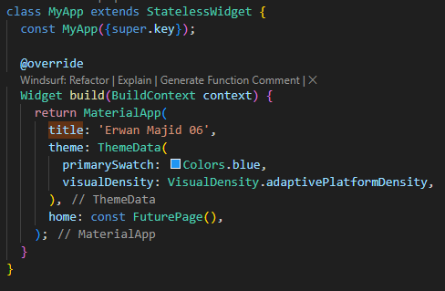
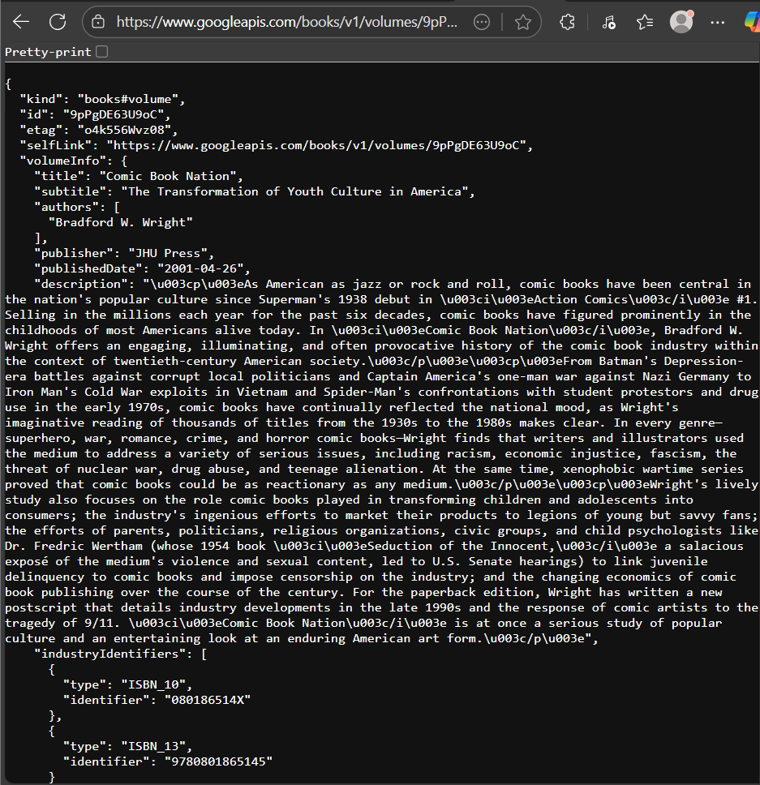

# Praktikum 1: Mengunduh Data dari Web Service (API)

## Soal 1

Tambahkan nama panggilan Anda pada title app sebagai identitas hasil
pekerjaan Anda

## Soal 2

cobalah akses di browser URI tersebut dengan lengkap seperti ini. Jika menampilkan data JSON, maka Anda telah berhasi

## Soal 3

Jelaskan maksud kode langkah 5 tersebut terkait substring dan catchError!

-substring : Untuk mencegah tampilan teks terlalu panjang di layar saat menampilkan hasil dari API.
Karena hasil Google Books API biasanya sangat panjang (ratusan baris JSON), jadi cukup ditampilkan sebagian

-catchError : digunakan untuk menangani error jika proses getData() gagal — misalnya:
Tidak ada koneksi internet, URL salah,Server API down

-setState : digunakan untuk memperbarui tampilan (UI) setiap kali nilai result berubah — baik saat sukses maupun error. Flutter akan me-render ulang Text(result) di layar dengan isi terbaru

substring(0, 450) membatasi teks dari hasil API supaya tidak terlalu panjang.
catchError menangkap dan menampilkan pesan error jika permintaan API gagal

## Result :

# Praktikum 2: Menggunakan await/async untuk menghindari callbacks

## Result :

## Soal 4

## Jelaskan maksud kode langkah 1 dan 2 tersebut!

method async :

tiga method asynchronous (returnOneAsync, returnTwoAsync, dan returnThreeAsync). Masing-masing method menggunakan Future.delayed selama tiga detik untuk mensimulasikan proses yang memerlukan waktu, seperti mengambil data dari server. Setelah waktu tunggu selesai, setiap method akan mengembalikan nilai bilangan bulat (1, 2, dan 3)

method count :
Di dalamnya terdapat variabel total yang digunakan untuk menampung hasil penjumlahan dari ketiga method sebelumnya. Prosesnya dilakukan secara berurutan menggunakan await, sehingga program akan menunggu setiap method selesai dijalankan sebelum melanjutkan ke berikutnya. Setelah ketiganya selesai, total hasil dijumlahkan menjadi 6 dan kemudian ditampilkan pada antarmuka pengguna melalui setState().

# Praktikum 3: Menggunakan Completer di Future

## Soal 5

## Result :

Jelaskan maksud kode langkah 2 tersebut!:

berfungsi untuk membuat proses asynchronous menggunakan Completer, yang memungkinkan kita mengontrol kapan sebuah Future dianggap selesai. Variabel completer menyimpan objek Completer<int> yang nantinya menghasilkan nilai berupa angka. Fungsi getNumber() memanggil calculate(), lalu mengembalikan Future dari completer. Sementara itu, fungsi calculate() menunda eksekusi selama 5 detik menggunakan Future.delayed(), kemudian menyelesaikan Future dengan memberikan nilai 42 melalui completer.complete(42). Hasilnya, setelah 5 detik, nilai 42 akan dikembalikan dan bisa ditampilkan ke layar.

## Soal 6

## Result :

Jelaskan maksud perbedaan kode langkah 2 dengan langkah 5-6 tersebut!

-Pada langkah 2, kode hanya menjalankan proses asynchronous dengan Completer, menunggu 5 detik, lalu mengembalikan nilai 42 tanpa memeriksa kemungkinan error.

-Sedangkan pada langkah 5–6, kode menambahkan blok try-catch untuk menangkap error selama proses Future.delayed, dan jika terjadi kesalahan, completer.completeError() dijalankan agar error dapat diteruskan ke .catchError() pada pemanggilan getNumber(). Dengan begitu, aplikasi menjadi lebih aman dan terkontrol karena mampu menampilkan pesan kesalahan jika terjadi error.
